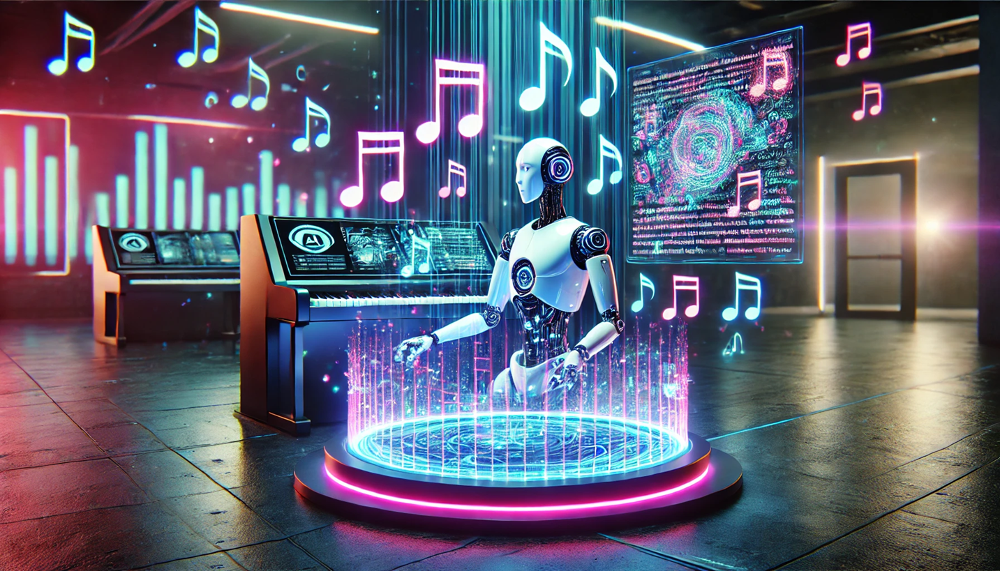
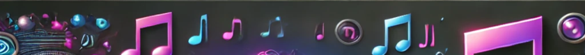

<!--
PEC3_Manovich_Reloaded
Autor: jortrifa@uoc.edu
-->

# PEC3: Visionando el futuro con las gafas de Manovich: redescubriendo la hibridación

### Recurso de aprendizaje de Cultura Digital

**Autor**: Jorge Trigueros Falqué

**Fecha**: 15/12/2024

## Planteamiento

Lev Manovich, en ***El Software toma el mando*** (2013), introduce el concepto de hibridación como un fenómeno central en la cultura del software contemporánea en el que se describe la capacidad de los medios digitales para combinar diferentes formas de expresión y técnicas en un solo entorno gracias a las herramientas informáticas. En este ensayo se tratarán dos casos de hibridación según la visión de Lev Manovich relacionados en cómo dos herramientas digitales permiten, mediante el uso de generadores de Inteligencia artificial, crear contenido cultural, como son la música y la escritura.

## Re-descubriendo la hibridacion: **Remusic**

**[Remusic](https://remusic.ai/en)** es una plataforma de IA para faciliar la composición y el aprendizaje musical. Esta herramienta permite crear música a partir de una descripción, al estilo de "quiero crear una canción instrumental donde se oiga una guitarra estilo Joe Satriani", o bien crear efectos de sonido, como por ejemplo un "un vaso de cristal rompiéndose contra el suelo".

Las librerias de efectos musicales no son nuevas, y las herramientas para crear música tampoco. Existen herramientas para PC como Cubase, a las que se les puede incluir librerías de efectos musicales, sintetizadores, samples etc.

Herramientas como **Remusic** adoptan la forma de crear música de herramientas de software como Cubase, pero transforman la forma de generar la música utilizando algoritmos digitales y herramientas de inteligencia artificial para generar música. Ya no se necesita tener cierto dominio de alúgn intrumento musical, conectar por poner un ejemplo la guitarra al PC, arrancar Cubase, usar algunas librerías o efectos y componer una canción. Hoy por hoy, con mayor o menor acierto, cualquier persona puede "componer" una canción, simplemente definiendo bien los criterios que quiere utilizar para dicha "composición", y ajustando dichos criterios hasta conseguir el resultado esperado.

Pero no sólo eso, si bien "antiguamente", en Cubase, por ejemplo, podiamos tener conjuntos de sonidos y loops que previamente habian sido creados de manera "manual" por un artista, con herramientas como **Remusic** cualquiera se peude convertir en ese artista que puede poner disposición de quien lo quiera usar las composiciones musicales que ha creado, o más bien que la inteligencia artificial ha creado.

En **Remusic**, la IA no se limita a ejecutar órdenes predefinidas sino que aporta su propia "personalidad" creativa al interpretar patrones musicales, estilos y estructuras armónicas sugeridas por el usuario, por lo que no solo amplifica las capacidades humanas, sino que también actúa como coautor.

Por otra parte, Manovich define la hibridación como "un proceso en el que diversos medios y tecnologías se combinan para dar lugar a sistemas y experiencias innovadores". Esto podemos podemos observarlo en **Remusic** al integrar diversas tecnologías y medios para crear nuevas formas de interactuar y experimentar con la música. En el caso de **Remusic**, se combinan elementos como:

- Inteligencia Artificial: Utiliza algoritmos avanzados para analizar, modificar y generar música, uniendo procesos tradicionales de composición con capacidades computacionales modernas.
- Audio digital: Se apoya en el procesamiento de sonido digital para generar nuevas composiciones musicales.
- Interactividad: Ofrece una interfaz accesible para que usuarios sin conocimientos técnicos profundos puedan participar en la creación o edición musical.

Podemos concluir, por tanto, que herramientas como **Remusic** han adaptado la forma de generar composiciones musicales, de distribuir conjuntos de sonidos y loops de los que anteriormente cualquier compositor podía hacer uso de ellos, y, a su vez, componer elementos musicales para, de manera similar, pero haciendo uso de algoritmos de inteligencia artificial, conseguir que cualquier persona pueda generar elementos musicales.
Crear una composición musical de forma "instantanea" sin que sea necesario tener conocimientos musicales, como hace **Remusic** no sería posible si cada tecnología o medio se utilizara de manera aislada, y en cuanto al concepto de "*nuevas formas de interacción*", en **Remusic** queda claro que el usuario para componer música tiene que interactuar con las herramientas generativas de IA para proponer, ajustar y modificar la obra resultante.

    
    <strong>Remusic</strong> ejemplifica cómo el software se convierte en una herramienta transformadora en la producción cultural, integrando la creatividad algorítmica en un proceso tradicionalmente humano.
    

## Re-descubriendo la hibridacion: **Sudowrite**

¿Quién no ha pensado alguna vez en escribir un libro? [**Sudowrite**](https://editor.sudowrite.com/) es una herramienta de inteligencia artificial que puede ayudarte a hacer el sueño de escribir un libro (documento, carta, o realmente cualquier tipo de texto) realidad.

Con **Sudowrite** podemos, partiendo de una idea, un genero, y un estilo solicitar a la herramienta generativa que nos desarrolle un texto, los personajes que saldrán en dicho texto con su biografía incluida, e incluso crear una estructura de capítulos o distribución del texto generado. Pero no solo eso, sino que, todos los elementos generados podemos redefinirlos, ajustarlo, o editarlos a nuestros gustos o conveniencia.

La herramienta **Sudowrite** es un ejemplo de hibridación según el concepto de Manovich porque integra múltiples tecnologías y medios en una sola herramienta de software para transformar y enriquecer la experiencia de escritura creativa.

En el caso de **Sudowrite**, se combinan elementos como:

- Inteligencia Artificial como colaborador creativo: **Sudowrite** combina algoritmos avanzados de procesamiento de lenguaje natural con herramientas tradicionales de escritura. Esto crea un entorno donde la tecnología no solo facilita el proceso, sino que actúa como un "coautor", sugiriendo frases, explorando estilos literarios o ampliando ideas.
- Diferentes disciplinas: Integra elementos de la informática (algoritmos de IA), la lingüística (modelos de lenguaje) y las prácticas literarias.
- Interactividad e innovación en la narrativa: Ofrece funciones como la generación automática de textos, reescritura de pasajes y personajes y creación de descripciones, herramientas que amplían las posibilidades creativas del usuario. Esto genera un nuevo tipo de experiencia narrativa donde el autor y las herrameintas de inteligencia artificial se juntan para la creación de recursos literarios.
- Adaptabilidad: La herramienta permite que escritores con diferentes estilos o géneros usen la IA como un complemento que se ajusta, o adapta más bien, a sus necesidades.

En el concepto de Manovich de hibridación respecto la integración de tecnologías digitales en procesos tradicionales, donde se crean sistemas en los que humanos y máquinas colaboran, en **Sudowrite** esta colaboración se manifiesta cuando el escritor proporciona un texto inicial, y la IA genera alternativas, expande narrativas o sugiere estructuras. En dicho proceso el humano evalúa y ajusta las propuestas de la IA, mientras que el software aprende del estilo del usuario. Esta interacción entre el hombre y la máquina representa el concepto de hibridación, donde ambos interactúan mutuamente para crear un producto final único.

Además, **Sudowrite** ilustra lo que Manovich denomina "hibridación en el lenguaje cultural". La IA opera a partir de un modelo de lenguaje entrenado en una vasta base de datos de textos literarios. Esto permite que la herramienta capture patrones narrativos y estilísticos que reflejan siglos de producción literaria, combinándolos de formas novedosas. Este proceso, aunque automatizado, no es mecánico: la herramienta puede imitar estilos de autores clásicos, pero también fusionar elementos de géneros dispares, creando híbridos literarios que son imposibles de lograr únicamente con habilidades humanas.

Por otra parte, **Sudowrite** amplía la accesibilidad a la escritura creativa. Para Manovich, el software democratiza la creatividad al proporcionar herramientas avanzadas que antes requerían experiencia técnica o literaria. Esto se representa en **Sudowrite** de marera clara, ya que no se necesita tener grandes dotes literarias ni experiencia en la creación de textos para poder, ayudado por la IA, generar productos literarios.

En resumen **Sudowrite** sirve de ejemplo de cómo un elemento tradicional como la escritura se combina con elementos digitales para dar lugar a una nueva obra, partiendo de unas ideas o premisas básica, todo ello mediante una interacción entre el hombre y la máquina, para proponer, ajustar y en ultimo caso modificar el resultado y cómo la combinación de tecnologías y medios puede crear nuevas experiencias, cambiando el paradigma tradicional de escritura y abriendo caminos para explorar nuevas formas narrativas, todo ello en línea con el concepto de hibridación descrito por Manovich.

### Referencias y Bibliografía

* Manovich, Lev. (2013). **El Software toma el mando**. Barcelona: Editorial UOC.
* [Janine heinrich](https://www.unite.ai/es/sudowrite-review/) (2024). **Revisión de Sudowrite: ¿Puede la IA escribir una novela que suene humana?**.
* [Remusic Blog](https://remusic.ai/blog/how-to-extend-music-with-ai) (2024). **How to Extend Music with AI**.

---

Licencia: Material Creative Commons desarrollado bajo licencia [CC BY-SA 4.0](https://creativecommons.org/licenses/by-sa/4.0/deed.es).
